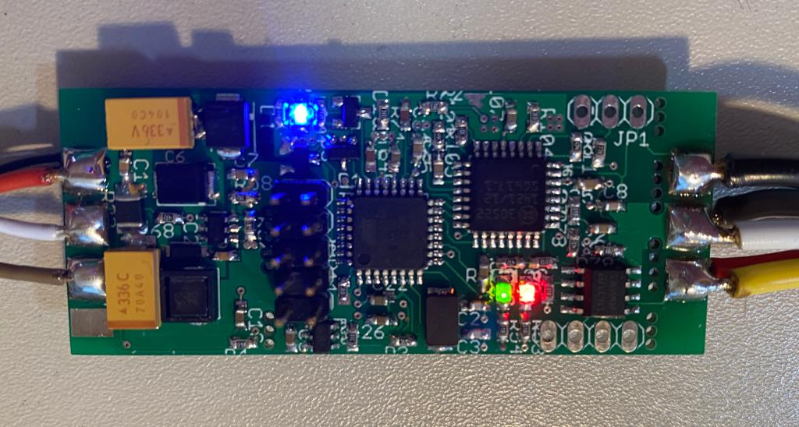

# BL49SP
Wideband Lambda Controller with Bosch CJ125 and LSU 4.9 
Usable as a stand-alone controller or as a add-in for your own design. 2-layer pcb - single side soldered 

20.04.2020 - basic tests are done, seems to be in a working state 

Version 0.0.1 - basic functions implemented: 0,5V - 4,5V equals AFR10-20 

Interactive BOM for easier hand-soldering you can download from the github (BL49SP/hardware/V0.0.1/bom)
or access online here: https://oelprinz.000webhostapp.com/BL49SP/V0.0.0.1/iBOM/ibom.html  

Quick link to schematic: https://github.com/oelprinz-org/BL49SP/blob/master/hardware/V0.0.1/schematics.pdf  

  
   
    
  

