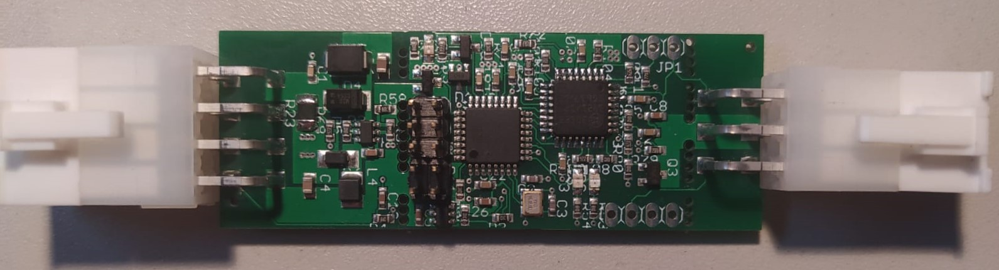
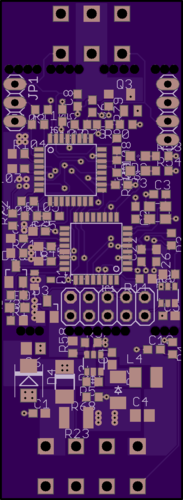
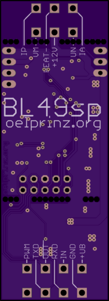
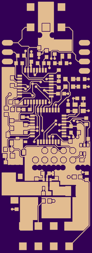
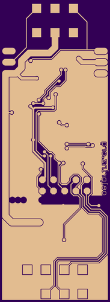
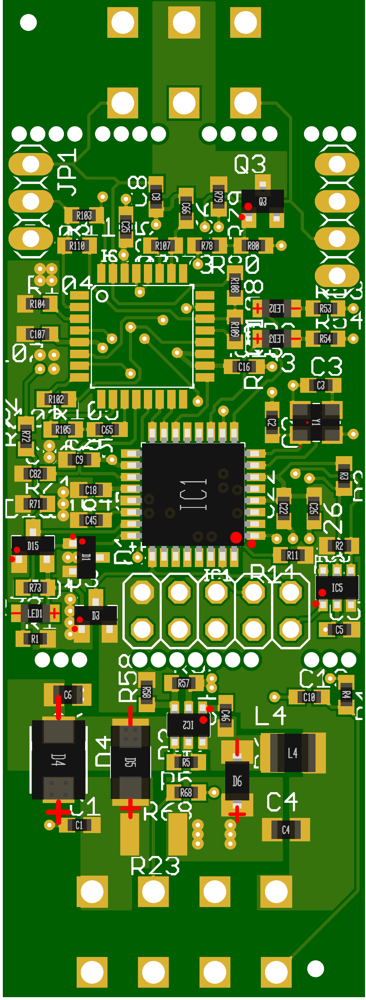

# BL49SP
Wideband Lambda Controller with Bosch CJ125 and LSU 4.9 
Usable as a stand-alone controller or as a add-in for your own design. 2-layer pcb - single side soldered 

20.04.2020 - Version 0.0.1: basic tests are done, seems to be in a working state 

Version 0.0.1 - basic functions implemented: 0,5V - 4,5V equals AFR10-20 

Version 0.0.2 - modifications for automated production process done - PCBs arrived - further tests needed 

Update 04.09.2020 - Version 0.0.2: First tests have shown the finished lambda controller in an working state. 
In idle mode Uout is 2,39V (Lambda 1,00). 
In running mode we have a Uout of 4,56V at AFR20 and a Uout of 0,54V at AFR10. 
All measurements have been done with a uncalibrated Multimeter and must be verified with a calibrated device. 
Possibly there is some room for more finetuning or improvements, but until here all looks fine so far.  
Current draw is only some milliAmps in idle mode, something around 1,7 A while heating and 0,7 A in running mode. 

Update 17.09.2020 - Added some illustrations to the wiki how to connect the board: https://github.com/oelprinz-org/BL49SP/wiki/Connecting-the-board

Precompiled firmware files and fuse settings you can find at https://github.com/oelprinz-org/BL49SP/tree/master/software/V0.0.2/Arduino/BL49SP/Build 

Interactive BOM for easier hand-soldering you can download from the github (BL49SP/hardware/V0.0.2/bom)
or access online here: https://oelprinz.000webhostapp.com/BL49SP/V0.0.2/iBOM/ibom.html  

Quick link to schematic: https://github.com/oelprinz-org/BL49SP/blob/master/hardware/V0.0.2/schematics.pdf  

  
   
    
  
  
  

