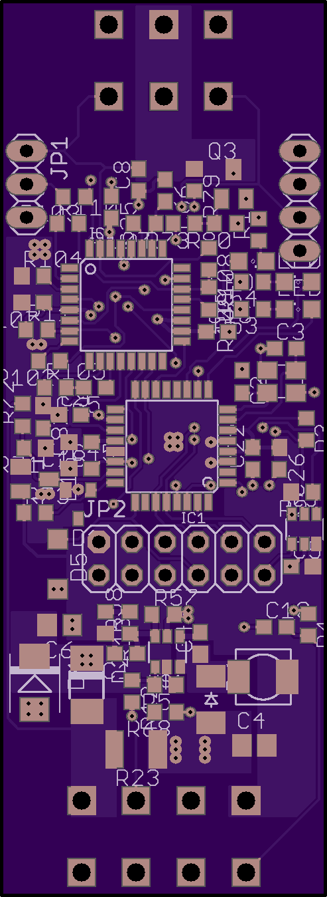
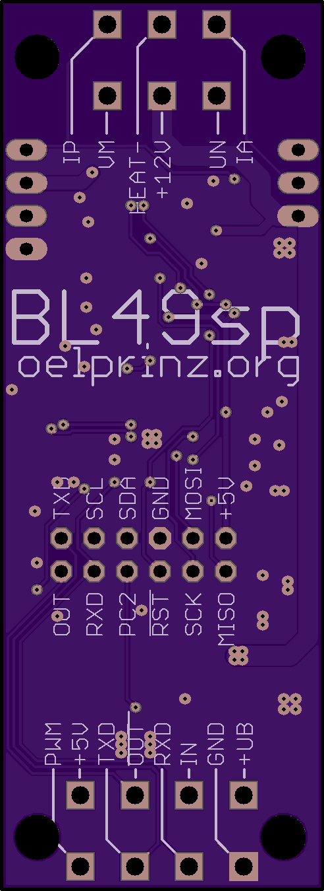
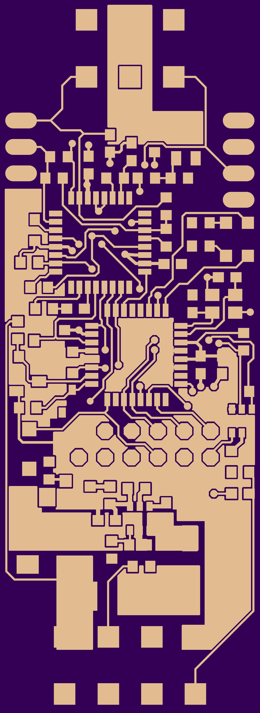
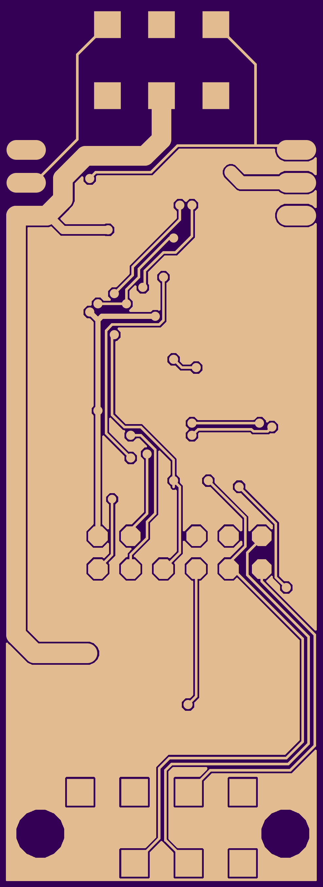
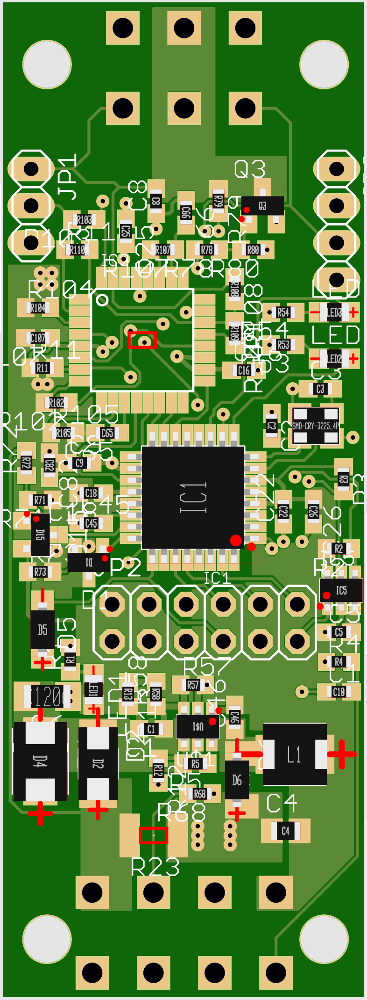

# BL49SP  -  V0.0.3
Wideband Lambda Controller with Bosch CJ125 and LSU 4.9 
Usable as a stand-alone controller or as a add-in for your own design. 2-layer pcb - single side soldered 

20.04.2020 - Version 0.0.1: basic tests are done, seems to be in a working state 

Version 0.0.1 - basic functions implemented: 0,5V - 4,5V equals AFR10-20 

Version 0.0.2 - modifications for automated production process done - PCBs arrived - further tests needed 

Version 0.0.2a - minor corrections on bottom silkscreen 

Version 0.0.3 - minor corrections / pins added to connect OLED-Display 

Update 04.09.2020 - Version 0.0.2: First tests have shown the finished lambda controller in an working state. 
In idle mode Uout is 2,39V (Lambda 1,00). 
In running mode we have a Uout of 4,56V at AFR20 and a Uout of 0,54V at AFR10. 
All measurements have been done with a uncalibrated Multimeter and must be verified with a calibrated device. 
Possibly there is some room for more finetuning or improvements, but until here all looks fine so far.  
Current draw is only some milliAmps in idle mode, something around 1,7 A while heating and 0,7 A in running mode. 

Update 17.09.2020 - Added some illustrations to the wiki how to connect the V0.0.2 board: https://github.com/oelprinz-org/BL49SP/wiki/Connecting-the-board-V0.0.2

V0.0.3 fabrication files for Jlcpcb: https://github.com/oelprinz-org/BL49SP/tree/master/fabrication/V0.0.3

not yet - Precompiled firmware files and fuse settings you can find at https://github.com/oelprinz-org/BL49SP/tree/master/software/V0.0.3/Arduino/BL49SP/Build 

Interactive BOM for easier hand-soldering you can download from the github (BL49SP/hardware/V0.0.3/bom)
or access online here: http://oelprinz.org/products/BL49SP/hardware/V0.0.3/iBOM/ibom.html  

Quick link to schematic: https://github.com/oelprinz-org/BL49SP/blob/master/hardware/V0.0.3/schematics.pdf  

## Bosch CJ125 (LQFP32 package) part numbers

|Bosch part number|
|:----------------|
|30615|
|40103|
|30522|

### Suitable Bosch lambda probes

Basically, the Bosch probes whose numbers start with **0 258 017** will fit, also Bosch **0 281 004**.  
Bosch numbers beginning with **0 258 007** are *LSU 4.2* probes and will not fit.

|Bosch number  |Length overall|Comment|
|--------------|--------------|-------|
|0 258 017 012 |1060mm||
|0 258 017 025 |1000mm|Bosch motorsport part, **tested during development**|
|0 281 004 028 |540mm|common probe for diesel engines, **Used during development**|
|0 258 017 029 |620mm|grey, used by BMW after 09/2006 (1178 7539124)|
|0 258 017 038 |340mm|grey, used by BMW (11787537984)|
|0 258 017 092 |950mm|black, used by BMW (1178 7540167)|
|0 258 017 126 |680mm|black, used by BMW after 09/2006 (1178 7561410)|
|0 281 004 150 |1215mm||
|0 281 004 184 |1000mm||
|...|||

### LSU4.9 probe pinout

|Pin#|Color|Description|Symbol|
|----|-----|--------|-----------|
|1|red|Pump current APE|IP|
|2|yellow|Virtual ground IPN|VM|
|3|white|Heater voltage H-|Uh-|
|4|grey|Heater voltaget H+|Uh+|
|5|green|Trim Resistor RT|IA|
|6|black|Nernst voltage UN|RE|  

  
   
  
  
  
  

